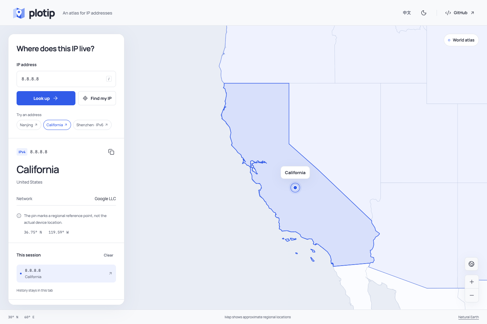
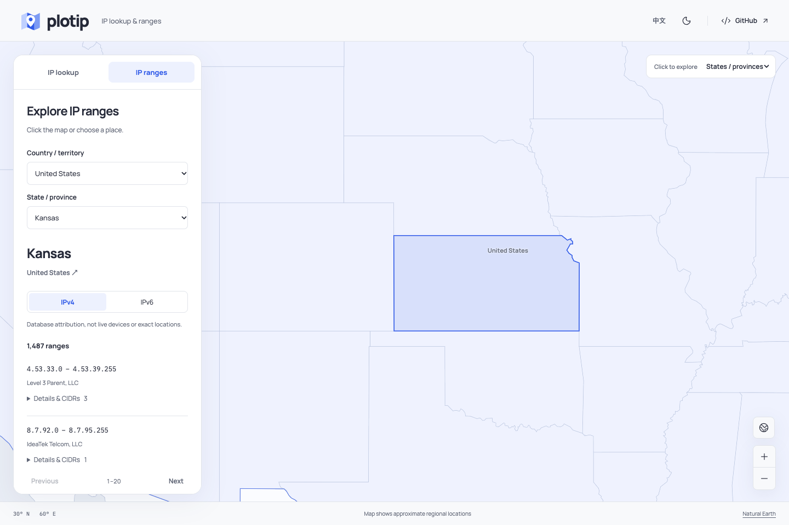

# Plotip

Every IP has a place. Look up an address and explore its region on a quiet, interactive map.

[Live website](https://plotip.vercel.app/) · [中文](README.zh-CN.md) · [Data & attribution](THIRD_PARTY_NOTICES.md) · [Development](docs/development.md)



- IPv4 and IPv6 lookup, with country, region, city and network details.
- Click a country or state to browse its IPv4 / IPv6 ranges, page through results, copy exact CIDRs and inspect an address.
- A self-hosted world map with regional boundaries. No map API key.
- City, region or country reference points, clearly distinguished from device locations.
- Session-only history, copy results, English / Chinese, light / dark themes.
- Server-side offline lookup. The browser receives results, never the XDB database.

No account, external database service, paid lookup API. Reverse lookup uses a bundled, read-only SQLite index.

## Run locally

Requires [uv](https://docs.astral.sh/uv/) and Node.js 22+.

```sh
git clone https://github.com/shanezchang/plotip.git
cd plotip
uv sync --locked
npm ci
npm run build
uv run uvicorn app:app --host 127.0.0.1 --port 8019
```

Open http://127.0.0.1:8019. The included data snapshot is ready to use; no keys or data download are needed to run the app after cloning.

For hot reload, run the Python server above and `npm run dev` in another terminal. Open http://127.0.0.1:5179.

## What a pin means

IP geolocation describes a network address, not a person's location. VPNs, proxies, shared gateways and stale records can all affect results. A city pin represents a GeoNames city center; region/country pins use Natural Earth reference coordinates. If a city cannot be matched unambiguously, the map falls back to the region or country and says so. If no reference point exists, the textual lookup still works.

The map shows regional reference locations. Zoom intentionally stops at regional scale. Private and reserved addresses are never assigned a geographic pin.

## Explore ranges by place



Click land on the map, or open **IP ranges** and choose a country and optional state/province. The map selector switches between country and state/province polygons. Filter IPv4 / IPv6, use Previous / Next for 20-record pages, and expand a row for its exact CIDRs, original locality and address count. **Look up first IP** returns to forward lookup.

These ranges are database attribution records, not a list of live devices, an ownership registry, or IPs for the precise point clicked. City boundaries are not supported. Ambiguous state names remain country-only; unmatched or non-public records are excluded. CIDRs exactly cover each recorded interval without widening it.

## Stack

Python 3.12 · uv · FastAPI · ip2region · Vite · TypeScript · MapLibre GL JS

One Vercel project: static frontend on the CDN, FastAPI as a Python Function. XDB, coordinate and reverse-lookup indexes remain in the function bundle. No paid mapping or lookup services. Hosting still has usage limits; see [deployment notes](docs/deployment.md).

## Checks

```sh
uv run pytest
uv run ruff check .
npm run build
npx playwright install chromium
npm run test:e2e
```

## Website analytics

The production website uses cookie-free Vercel Web Analytics for aggregate traffic. DNT/GPC disable collection; URL queries and fragments are stripped. Queried IP addresses and results are not analytics events. Local development and other hostnames stay untracked. See [analytics and search operations](docs/analytics.md).

## License

Application: MIT. Geographic datasets and dependencies retain their own terms; see [third-party notices](THIRD_PARTY_NOTICES.md). Plotip is an independent project built with ip2region, not its official website or commercial data service.
